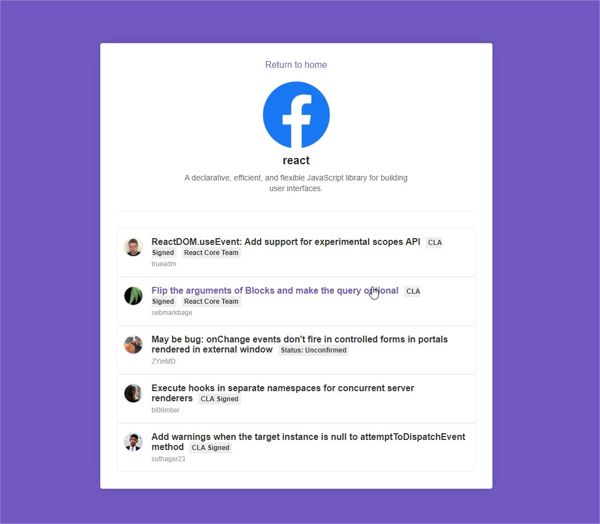

# Check your Repositories from github
Application developed in React that shows repos from git hub e its details and issues!

## How it Works?

* Step 1: Find your repo like the image below:
 

* Step 2: Add your repo to fill the list:
 

* Step 3: Now you are able to check out details of your projetct on link details on that list:
 

* Step 4: To you check all issues that was created in your repository, just open details too, it will appears below the description as a list:


# Setting  enviroment up
### Configure Node.js
Check here how to install node, please select the stable version [Node](https://nodejs.org/en/).

### Configure npm
* After clone this repo follow the steps below
* Run ```npm install ``` in your command line, you need to run inside your local repository
* Then run ```react-scripts start ```. to listen the app on:```http://localhost:3000/#/```

### Dependeces using yarn
* Follow the steps to for [yarn instalation](https://nodejs.org/en/).
* Run ```yarn ``` in your command line to download all dependencies in your source, you need to run inside your local repository
* Then run ```yarn start ```. to listen the app on:```http://localhost:3000/#/```
